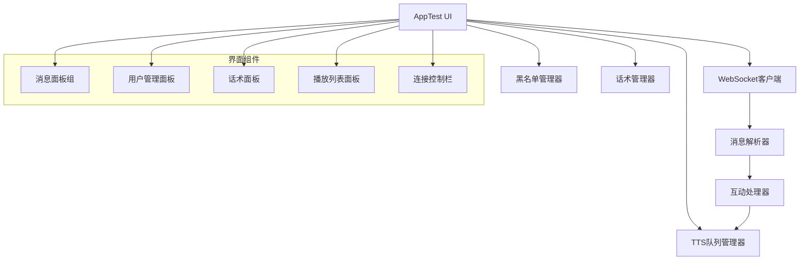
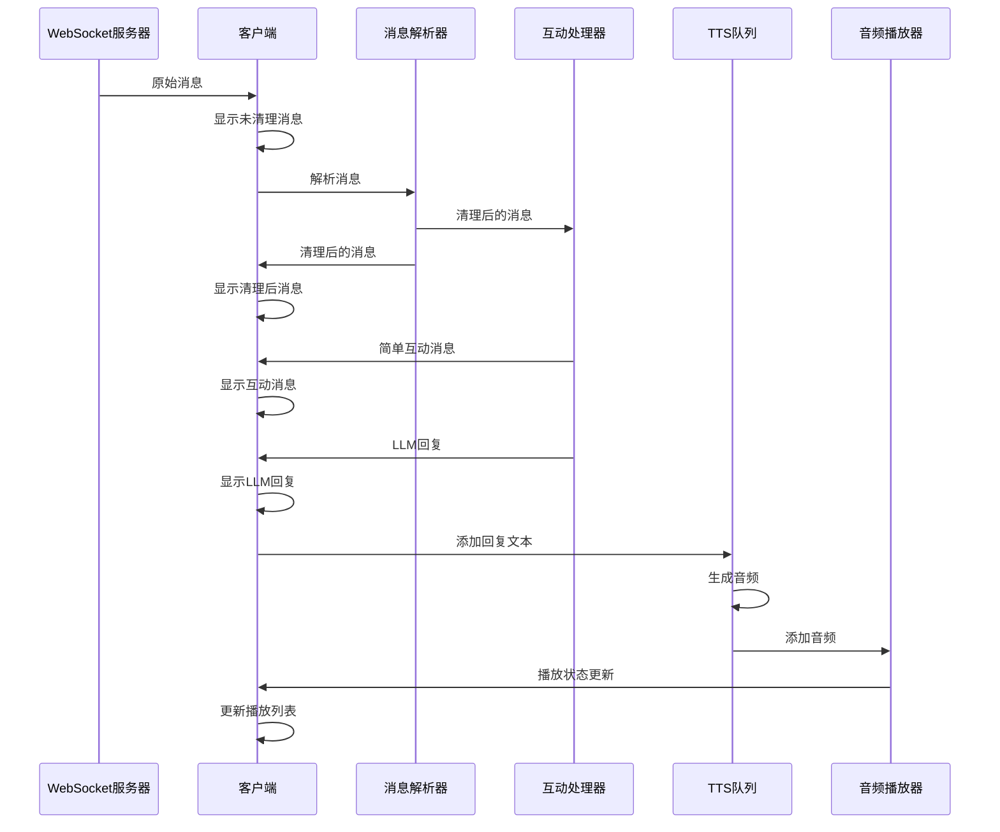

# 抖音电商无人直播系统 - 全流程测试App实施计划

## 概述
全流程测试App (app_test_ui.py) 是抖音电商无人直播系统的综合测试应用，旨在整合WebSocket消息处理、LLM响应生成、TTS生成与播放等所有核心功能模块，形成完整的测试环境。基于SVG原型图（全流程测试1.svg）设计实现，将作为验证直播工作流的关键工具。

## 设计目标
1. **全流程集成**：整合WebSocket、消息解析、LLM响应和TTS播放全流程
2. **可视化监控**：直观显示各环节处理状态和数据流转
3. **优先级验证**：验证多级优先级队列和动态优先级计算机制
4. **质量控制测试**：测试TTS无声检测和多模型轮换策略
5. **用户体验评估**：评估打断/恢复机制对用户体验的影响

## 应用架构

### 核心组件


### 数据流程


## 界面布局设计

根据SVG原型图，界面将分为以下主要区域：

1. **顶部控制区**
   - 标题
   - 连接/断开按钮
   - 状态显示

2. **上部消息处理区（四列布局）**
   - 第一列：未清理消息面板
   - 第二列：清理后消息面板
   - 第三列：简单互动消息面板
   - 第四列：LLM回复面板

3. **下部功能区（三列布局）**
   - 第一列：用户黑名单管理（带添加/删除按钮）
   - 第二列：话术列表
   - 第三列：播放列表

## 实施步骤

### 1. 基础框架搭建
- 创建`app_test_ui.py`主文件
- 设计主窗口类`AppTestUI`继承自`QMainWindow`
- 实现基本布局和组件框架

### 2. 组件整合与功能模块实现
- **WebSocket连接与消息处理**
  - 集成WebSocketTester
  - 实现消息解析和分发逻辑
  - 添加连接状态监控

- **用户黑名单管理**
  - 实现黑名单列表显示
  - 添加用户功能
  - 删除用户功能
  - 黑名单持久化存储

- **话术管理**
  - 话术列表显示
  - 话术加载和选择功能
  - 将选中话术发送到TTS队列

- **TTS与音频播放**
  - 集成TTSQueueManager
  - 实现播放列表显示
  - 添加播放控制功能（播放、暂停、停止）

- **消息流程管理**
  - 实现消息处理流水线
  - 添加优先级处理机制
  - 实现消息过滤和分类显示

### 3. 优化与功能扩展
- 添加静音检测和处理
- 实现评论优先级机制
- 添加系统状态监控与显示
- 实现配置文件加载和设置界面

## 关键代码结构

```python
class AppTestUI(QMainWindow):
    """抖音直播系统全流程测试界面"""
    
    def __init__(self):
        super().__init__()
        self.setWindowTitle("抖音直播系统全流程测试")
        self.resize(1300, 800)
        
        # 初始化日志
        self.logger, self.raw_logger = self._setup_logging()
        
        # 创建信号对象
        self.signals = WebSocketSignals()
        
        # 创建WebSocket测试客户端
        self.ws_client = WebSocketTester(
            signals=self.signals,
            logger=self.logger,
            raw_logger=self.raw_logger
        )
        
        # 初始化TTS队列管理器
        self.tts_manager = TTSQueueManager()
        
        # 初始化用户黑名单
        self.blacklist = []
        self.load_blacklist()
        
        # 设置信号连接
        self._connect_signals()
        
        # 设置UI组件
        self._setup_ui()
        
        # 启动TTS队列和状态监控
        self.tts_manager.start()
        self._start_status_monitor()
```

## 技术挑战与解决方案

### 1. TTS静音检测问题
#### 挑战
- GPT-SoVITS偶尔生成无声或低质量音频
- 检测过程不应阻塞主流程
- 需要智能重试策略避免反复失败

#### 解决方案
- 集成AudioVADDetector进行VAD检测
- 实现非阻塞式检测机制
  ```python
  def _check_audio_quality(self, audio_path, item_id):
      # 在单独线程中运行VAD检测
      def vad_task():
          result = self.vad_detector.detect_speech(audio_path)
          # 通过信号通知检测结果
          if not result.has_speech:
              self.tts_silence_detected.emit(item_id)
              
      threading.Thread(target=vad_task, daemon=True).start()
  ```
- 添加多模型轮换策略
  ```python
  def _retry_with_alternative_model(self, text, item_id, attempt=0):
      # 在重试时轮换不同TTS模型
      models = ["model1", "model2", "model3"]
      selected_model = models[attempt % len(models)]
      # 使用选定模型生成TTS
      return self.tts_client.generate_with_model(text, selected_model)
  ```
- 实现智能退避策略控制重试频率

### 2. 评论优先级处理
#### 挑战
- 需要动态计算不同消息的优先级
- 打断当前音频可能影响用户体验
- 需要平衡即时响应与连贯体验

#### 解决方案
- 实现动态优先级计算算法
  ```python
  def _calculate_priority(self, message):
      # 基础优先级 - 基于消息类型
      base_priority = self.priority_map.get(message['type'], Priority.NORMAL)
      
      # 用户因素
      user_level = message.get('user', {}).get('level', 0)
      user_score = min(user_level / 10, 1.0)  # 标准化为0-1范围
      
      # 内容因素 - 检测关键词和情感
      content_score = self._analyze_content(message.get('content', ''))
      
      # 时间因素 - 考虑消息新鲜度
      time_factor = self._calculate_time_factor(message.get('timestamp', 0))
      
      # 综合计算最终优先级
      final_priority = base_priority - (user_score * 0.2) - (content_score * 0.3) - (time_factor * 0.1)
      return max(Priority.HIGH, min(Priority.LOW, final_priority))  # 限制在有效范围内
  ```
- 设计智能中断决策算法
  ```python
  def _should_interrupt(self, new_priority, current_priority, elapsed_ratio):
      # 新消息优先级较高且当前播放还不到一半时才中断
      if new_priority < current_priority and elapsed_ratio < 0.5:
          return True
      # 新消息优先级极高时强制中断
      if new_priority == Priority.HIGH and current_priority > Priority.HIGH:
          return True
      return False
  ```
- 实现平滑过渡的恢复机制
  ```python
  def _handle_interrupted_playback(self, interrupted_audio):
      # 保存中断时的位置信息
      self.interrupted_stack.append({
          'audio_path': interrupted_audio,
          'position': self.audio_player.get_position(),
          'priority': self.current_priority
      })
      
      # 播放完成后检查是否需要恢复被中断的音频
      def on_completion():
          if self.interrupted_stack:
              last_interrupted = self.interrupted_stack.pop()
              self.audio_player.play_from_position(
                  last_interrupted['audio_path'],
                  last_interrupted['position'],
                  last_interrupted['priority']
              )
              
      return on_completion
  ```

### 3. 多组件协调问题
#### 挑战
- WebSocket、LLM和TTS模块需要良好协调
- 资源争用可能导致性能下降
- 组件间状态同步要求高一致性

#### 解决方案
- 使用事件总线实现松耦合通信
  ```python
  def _connect_signals(self):
      # WebSocket信号连接
      self.signals.raw_message_received.connect(self.on_raw_message)
      self.signals.clean_message_received.connect(self.on_clean_message)
      self.signals.interaction_message_received.connect(self.on_interaction_message)
      self.signals.llm_response_received.connect(self.on_llm_response)
      
      # TTS信号连接
      self.tts_manager.tts_started.connect(self.on_tts_started)
      self.tts_manager.tts_completed.connect(self.on_tts_completed)
      self.tts_manager.tts_failed.connect(self.on_tts_failed)
      self.tts_manager.tts_silence_detected.connect(self.on_silence_detected)
      
      # 音频播放信号
      self.tts_manager.audio_started.connect(self.on_audio_started)
      self.tts_manager.audio_completed.connect(self.on_audio_completed)
      self.tts_manager.audio_interrupted.connect(self.on_audio_interrupted)
  ```
- 实现资源监控和限制机制
  ```python
  def _monitor_resources(self):
      # 监控关键资源使用情况
      memory_usage = self._get_memory_usage()
      cpu_usage = self._get_cpu_usage()
      
      # 根据资源使用情况调整处理策略
      if memory_usage > 80:  # 百分比
          self._reduce_cache_size()
          
      if cpu_usage > 70:  # 百分比
          self._limit_parallel_tasks()
  ```
- 添加统一的状态管理中心
  ```python
  class SystemStateManager:
      """系统状态管理中心，协调各组件状态"""
      
      def __init__(self):
          self.ws_connected = False
          self.tts_running = False
          self.llm_available = False
          self.playing_audio = False
          self.current_task = None
          self.queue_stats = {'tts': 0, 'audio': 0, 'messages': 0}
          
      def update_state(self, component, state_key, value):
          """更新组件状态"""
          old_value = getattr(self, state_key, None)
          setattr(self, state_key, value)
          
          # 触发状态变化处理
          if old_value != value:
              self._handle_state_change(component, state_key, old_value, value)
              
      def _handle_state_change(self, component, state_key, old_value, new_value):
          """处理状态变化，执行相应调整"""
          # 根据状态变化调整系统行为
          pass
  ```

### 4. 界面响应性
#### 挑战
- 后台处理不应导致UI卡顿
- 大量消息可能导致界面更新过频
- 耗时操作可能阻塞主线程

#### 解决方案
- 将所有耗时操作放入工作线程
  ```python
  def _process_message_async(self, message):
      # 创建工作线程处理耗时操作
      def worker():
          result = self.processor.process_message(message)
          # 使用信号更新UI
          self.message_processed.emit(result)
          
      threading.Thread(target=worker, daemon=True).start()
  ```
- 使用信号槽机制更新UI
  ```python
  @pyqtSlot(dict)
  def on_clean_message(self, message):
      """处理清理后的消息，更新UI"""
      msg_type = message.get('type', '')
      user = message.get('user', {})
      nickname = user.get('nickname', '')
      
      if msg_type == 'comment':
          content = message.get('content', '')
          formatted = f"用户{nickname}评论：{content}"
          self.clean_messages.append(formatted)
  ```
- 实现消息合并和批量更新
  ```python
  def _batch_update_messages(self):
      # 收集指定时间内的消息
      current_time = time.time()
      batch_messages = []
      
      while self.message_queue and len(batch_messages) < self.max_batch_size:
          if current_time - self.last_update > self.update_interval:
              batch_messages.append(self.message_queue.popleft())
          else:
              break
              
      # 批量更新UI
      if batch_messages:
          self._update_ui_with_messages(batch_messages)
          self.last_update = current_time
  ```

## 与现有组件的关系

本全流程测试App整合了多个现有测试组件，并做了以下扩展：

1. **与WebSocketTestUI的关系**
   - 扩展了WebSocketTestUI的功能，保留其消息显示和连接控制
   - 增加了话术列表和播放列表显示
   - 增强了黑名单管理功能
   - 添加了更完善的状态监控和资源管理

2. **与TTSQueueManager的关系**
   - 直接集成TTSQueueManager管理TTS生成和播放
   - 增加了VAD检测结果可视化
   - 添加了播放队列状态监控
   - 实现了优先级机制的直观展示

3. **与MessageParser的关系**
   - 使用现有MessageParser处理WebSocket消息
   - 添加了消息流可视化展示
   - 增强了消息类型区分和优先级标记

4. **与AudioVADDetector的关系**
   - 集成AudioVADDetector进行音频质量检测
   - 添加了检测结果可视化
   - 实现了检测和重试策略的交互调试

## 测试与评估

全流程测试App不仅是一个功能测试工具，同时也是系统评估和性能监控平台：

1. **功能测试**
   - 验证WebSocket连接和消息处理
   - 测试消息解析和分类
   - 验证LLM响应生成
   - 测试TTS生成和音频播放
   - 验证优先级处理和打断机制

2. **性能监控**
   - 消息处理延迟统计
   - LLM响应时间监控
   - TTS生成时间统计
   - 资源使用情况跟踪
   - 队列长度和处理速率监控

3. **用户体验评估**
   - 响应及时性评估
   - 音频质量评估
   - 打断体验评估
   - 整体交互流畅度评估

## 实施时间线

| 阶段 | 任务 | 预计时间 |
|-----|-----|--------|
| 1 | 基础框架搭建 | 2天 |
| 2 | WebSocket组件集成 | 1天 |
| 3 | TTS组件集成 | 2天 |
| 4 | 黑名单和话术管理 | 1天 |
| 5 | 优先级处理机制实现 | 2天 |
| 6 | VAD检测和重试策略 | 2天 |
| 7 | 界面优化和状态监控 | 1天 |
| 8 | 测试与调试 | 2天 |
| **总计** | | **13天** |

## 进一步发展

全流程测试App完成后，可以进一步发展为以下方向：

1. **性能优化工具**
   - 添加性能分析和瓶颈检测
   - 实现自动化测试脚本
   - 添加压力测试功能

2. **系统监控平台**
   - 扩展为完整的系统监控工具
   - 添加数据可视化和趋势分析
   - 实现异常检测和预警

3. **调试和开发环境**
   - 增强为开发者工具
   - 添加组件配置和调参功能
   - 实现实时代码热更新

## 总结

全流程测试App是抖音电商无人直播系统的关键测试工具，将整合所有核心模块，提供全面的测试和监控环境。通过解决TTS静音检测、评论优先级处理、多组件协调等技术挑战，该应用将极大提升系统的稳定性和用户体验，推动项目向下一阶段发展。
