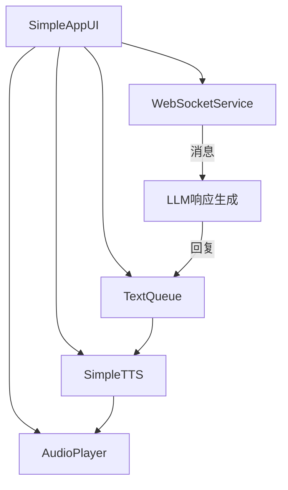

# 抖音直播系统 - 极简实现设计方案

## 系统概览

基于"简化流程2.html"中的流程图，我们设计一个集成WebSocketService、TextQueue、SimpleTTS和AudioPlayer的极简实现方案，保持核心功能完整性的同时简化系统复杂度。

## 系统架构



## 组件详细说明

### 1. SimpleAppUI
- **职责**：提供极简化的用户界面，集成和控制各个核心组件
- **主要功能**：
  - 初始化并连接所有核心组件
  - 提供基本的用户控制界面（开启/关闭WebSocket连接等）
  - 显示系统状态和消息日志
  - 管理组件间的信号连接和数据传递

### 2. WebSocketService
- **职责**：连接抖音直播WebSocket服务器，接收直播评论
- **主要功能**：
  - 建立和维护WebSocket连接
  - 接收和解析直播消息
  - 将清理后的评论传递给LLM处理
  - 提供连接状态监控

### 3. LLM响应生成
- **职责**：处理直播评论并生成相应回复
- **主要功能**：
  - 分析评论内容和意图
  - 生成适当的回复文本
  - 将回复添加到文本队列

### 4. TextQueue
- **职责**：管理需要转换为语音的文本队列
- **主要功能**：
  - 维护文本处理优先级队列
  - 按优先级排序处理文本
  - 将待处理文本传递给TTS模块

### 5. SimpleTTS
- **职责**：将文本转换为语音
- **主要功能**：
  - 接收文本并生成对应的语音文件
  - 发出语音生成状态的信号
  - 将生成的语音传递给音频播放器

### 6. AudioPlayer
- **职责**：播放TTS生成的语音文件
- **主要功能**：
  - 接收音频文件并播放
  - 管理播放队列和状态
  - 提供基本的播放控制功能

## 数据流程

1. **WebSocket接收**：WebSocketService接收直播评论
2. **消息处理**：评论被清理和解析后传递给LLM处理
3. **LLM响应**：LLM生成回复文本，添加到TextQueue
4. **TTS生成**：SimpleTTS从TextQueue获取文本，转换为语音文件
5. **音频播放**：AudioPlayer接收音频文件并播放

## 极简实现策略

### 1. 组件精简方案
- 只保留核心功能模块
- 移除复杂的状态监控和高级功能
- 简化组件间的依赖关系
- 合并功能相似的模块

### 2. UI简化方案
- 使用简单的垂直和水平布局
- 只显示必要的控制元素和状态指示
- 精简日志和状态显示
- 减少嵌套布局层次

### 3. 功能精简
- 使用现有的简化版组件实现（如SimpleTTS）
- 保留基本的队列处理和优先级机制
- 简化消息过滤和处理流程
- 使用直接的信号-槽连接替代复杂的回调链

## 实现计划

### SimpleStreamSystem类设计
```python
class SimpleStreamSystem:
    def __init__(self):
        # 初始化所有组件
        self.text_queue = TextQueue()
        self.tts = SimpleTTS()
        self.audio_player = AudioPlayer()
        self.websocket_service = self._setup_websocket_service()
        
        # 连接信号和槽
        self._connect_signals_slots()
        
    def _setup_websocket_service(self):
        # 创建和配置WebSocketService
        # 设置处理评论的回调函数
        
    def _connect_signals_slots(self):
        # 连接各组件之间的信号和槽
        # TextQueue -> TTS -> AudioPlayer
        
    def start(self):
        # 启动各组件
        
    def stop(self):
        # 停止各组件
```

### SimpleApp类设计
```python
class SimpleApp(QMainWindow):
    def __init__(self):
        # 初始化UI
        # 创建SimpleStreamSystem实例
        
    def _setup_ui(self):
        # 设置UI元素
        
    def _connect_signals(self):
        # 连接UI与系统组件的信号
```

## 实现步骤

1. **基础代码框架创建**
   - 创建simple_livestream_system.py作为系统核心
   - 创建simple_app.py作为UI入口
   - 设置基本的类结构和方法

2. **核心组件集成**
   - 集成现有的WebSocketService
   - 集成SimpleTTS和AudioPlayer
   - 集成TextQueue

3. **信号-槽连接设置**
   - 建立WebSocketService与LLM处理之间的连接
   - 连接LLM响应到TextQueue
   - 连接TextQueue到TTS处理
   - 连接TTS到AudioPlayer

4. **UI界面实现**
   - 创建简化的用户界面
   - 添加基本控制元素
   - 实现状态显示和日志功能

5. **功能测试与优化**
   - 测试完整的消息流程
   - 检查并解决信号连接问题
   - 优化性能和资源使用

## 技术注意事项

1. **线程安全**
   - 确保UI操作在主线程中执行
   - 多线程组件使用适当的同步机制
   - 使用正确的信号-槽连接类型

2. **资源管理**
   - 实现完整的启动和关闭流程
   - 确保资源正确释放
   - 避免内存泄漏和资源竞争

3. **错误处理**
   - 实现基本的异常捕获和处理
   - 添加日志记录关键错误
   - 确保单点故障不会导致系统崩溃

## 预期成果

完成极简实现后，系统将：
1. 提供从WebSocket消息接收到音频播放的完整功能链路
2. 具有简洁直观的用户界面
3. 保持较低的资源占用
4. 具备基本的错误恢复能力
5. 为未来扩展保留架构灵活性

## 后续优化方向

1. 增强WebSocket连接的稳定性
2. 改进TTS质量和性能
3. 增加更多的用户交互功能
4. 优化队列管理和优先级计算
5. 添加更详细的系统状态监控
