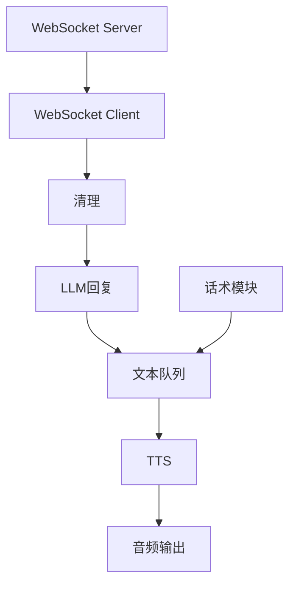

# 抖音电商无人直播系统 - 简化实现计划

## 简化目标
基于"简化流程.html"的图示和现有代码分析，实现一个核心功能完备但架构简化的抖音无人直播系统。保留关键功能链路，移除非必要的复杂组件和功能，提高系统稳定性和开发效率。

## 简化后的系统架构

## 核心组件保留策略

### 1. 保留原有核心组件
- **WebSocket客户端/服务器**：保持现有实现不变
- **消息处理模块**：继续使用现有的MessageParser
- **LLM回复模块**：保持现有的交互处理器
- **TTS队列**：使用SimpleTTSQueueManager简化版实现
- **音频播放器**：保留AudioPlayer基础功能

### 2. 简化UI界面
- 从复杂的多面板布局简化为更集中的功能区
- 只保留必要的控制按钮和状态显示
- 简化状态监控和日志显示
- 减少非必要的可视化组件

### 3. 精简导入和依赖
- 只保留必要模块的导入
- 移除非核心功能的类和方法
- 简化组件间的依赖关系
- 降低系统整体复杂度

## 简化计划详细策略

### UI简化方案
1. **布局简化**
   - 移除复杂的多选项卡和网格布局
   - 使用简单的垂直流布局和少量水平布局
   - 保持关键功能区域的清晰分隔

2. **组件精简**
   - 只保留核心控制按钮和状态显示
   - 简化列表和文本区域，减少重复信息
   - 合并功能相似的控制元素

3. **状态显示简化**
   - 减少复杂的状态指示器和进度条
   - 使用简单文本标签显示关键状态
   - 合并多个监控面板为单一日志区域

### 功能精简策略

1. **消息处理简化**
   - 直接使用现有的消息解析器
   - 保留评论、礼物、关注等核心消息类型处理
   - 简化过滤规则和处理流程

2. **TTS队列简化**
   - 使用现有的SimpleTTSQueueManager
   - 保留基本的队列处理和优先级
   - 简化音频质量监控功能

3. **话术管理简化**
   - 使用直接文件加载替代复杂话术生成
   - 简化话术选择逻辑
   - 减少话术变体生成和模板处理

4. **音频处理简化**
   - 简化音频质量检测机制
   - 保留基本播放功能
   - 简化音频设备选择和控制

## 代码重构方案

### app_test_ui.py重构
1. **导入简化**
   - 只保留必要的模块导入
   - 简化自定义模块的导入路径
   - 移除未使用的库

2. **类结构简化**
   - 重命名为SimpleAppUI，突显简化本质
   - 减少辅助类和内部方法
   - 合并功能相似的方法

3. **信号处理简化**
   - 减少信号定义和连接
   - 简化信号处理槽函数
   - 优化信号传递流程

4. **界面构建简化**
   - 使用更简洁的UI构建方法
   - 减少嵌套布局层次
   - 简化控件创建和配置

## 实现计划

1. **基础框架实现**
   - 创建SimpleAppUI类作为主界面
   - 设置基本布局和控件
   - 实现核心功能连接

2. **核心组件集成**
   - 集成现有WebSocket客户端
   - 集成SimpleTTSQueueManager
   - 集成消息处理器

3. **消息流处理实现**
   - 实现WebSocket消息接收
   - 连接消息处理和LLM响应
   - 实现TTS生成和播放流程

4. **话术功能实现**
   - 添加简化的话术加载功能
   - 实现基本的话术播放机制
   - 连接到TTS队列

5. **状态监控实现**
   - 添加简化的状态监控定时器
   - 实现基本的日志显示
   - 添加队列状态监控

## 技术注意事项

1. **性能考虑**
   - 保持非阻塞UI设计
   - 维持关键组件的多线程处理
   - 简化但不删除必要的资源管理

2. **代码质量**
   - 保持清晰的类和方法命名
   - 添加适当的注释说明简化策略
   - 确保核心功能的错误处理完整

3. **可扩展性**
   - 保持核心接口的一致性
   - 为未来可能的功能增强预留结构
   - 模块化设计允许单独组件升级

## 预期成果

完成简化实现后，系统将:
1. 保持完整的消息处理到音频输出的核心流程
2. 提供更简洁的用户界面，突显核心功能
3. 减少代码复杂度和潜在的问题点
4. 保持与现有组件的兼容性，允许未来扩展
5. 提高系统整体的稳定性和可维护性

## 后续优化方向

完成简化实现后，可以考虑以下优化:
1. 逐步改进UI体验，添加更多直观控制
2. 优化话术管理，支持更灵活的话术选择
3. 增强TTS质量监控，改进无声音频处理
4. 完善系统状态监控和日志记录
5. 添加更多的用户黑名单和消息过滤功能
